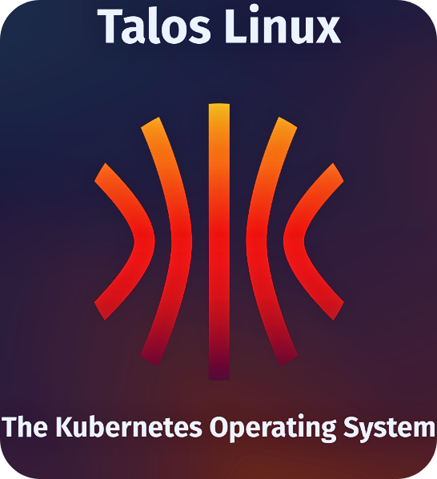

<h1 align="center">HOMELAB INFRASTRUCTURE TALOS</h1>

<div align="center">
  
</div>

<br>


<h2 align="center">SECURITY SCAN PIPELINES</h2>

<p align="center">
  <a href="https://github.com/Timotej979/Homelab-infrastructure-talos/actions/workflows/shellcheck-install-scripts.yml">
    
  </a>
  <a href="https://github.com/Timotej979/Homelab-infrastructure-talos/actions/workflows/cve-repository-scan.yml">
    
  </a>
  <a href="https://github.com/Timotej979/Homelab-infrastructure-talos/actions/workflows/packer-validate-syntax.yml">
    
  </a>
</p>

<br>


<h2 align="center">RELEASE PIPELINES</h2>

<p align="center">
  <a href="https://github.com/Timotej979/Homelab-infrastructure-talos/actions/workflows/build-alicloud.yml">
    
  </a>
  <a href="https://github.com/Timotej979/Homelab-infrastructure-talos/actions/workflows/build-gcp.yml">
    
  </a>
</p>
<p align="center">
  <a href="https://github.com/Timotej979/Homelab-infrastructure-talos/actions/workflows/build-aws.yml">
    
  </a>
  <a href="https://github.com/Timotej979/Homelab-infrastructure-talos/actions/workflows/build-azure.yml">
    
  </a>
  <a href="https://github.com/Timotej979/Homelab-infrastructure-talos/actions/workflows/build-tencent.yml">
    
  </a>
</p>

<br>


<p align="center">
  <a href="https://github.com/Timotej979/Homelab-infrastructure-talos/actions/workflows/build-hetzner.yml">
    
  </a>
  <a href="https://github.com/Timotej979/Homelab-infrastructure-talos/actions/workflows/build-linode.yml">
    
  </a>
</p>

<p align="center">
  <a href="https://github.com/Timotej979/Homelab-infrastructure-talos/actions/workflows/build-digital-ocean.yml">
    
  </a>
  <a href="https://github.com/Timotej979/Homelab-infrastructure-talos/actions/workflows/build-huawei.yml">
    
  </a>
  <a href="https://github.com/Timotej979/Homelab-infrastructure-talos/actions/workflows/build-ibm.yml">
    
  </a>
</p>

<p align="center">
  <a href="https://github.com/Timotej979/Homelab-infrastructure-talos/actions/workflows/build-oci.yml">
    
  </a>
  <a href="https://github.com/Timotej979/Homelab-infrastructure-talos/actions/workflows/build-ovh.yml">
    
  </a>
  <a href="https://github.com/Timotej979/Homelab-infrastructure-talos/actions/workflows/build-vultr.yml">
    
  </a>
</p>

---

This repository ia a collection of independently-versioned packer release processes for machine images of Talos OS for various platforms. The packer configurations are designed to be run in a CI/CD pipeline to build and release new versions of Talos OS images on a regular basis.


## Requirements

Requirements for using the automatic build pipeline comprising of install-scripts, packer configurations, security scans and release processes:

- Install scripts:
  - POSIX Shell ([Link](https://pubs.opengroup.org/onlinepubs/9699919799/))
  - jq ([Link](https://stedolan.github.io/jq/))
  - curl ([Link](https://curl.se/))
  - quemu-img ([Link](https://www.qemu.org/))

- Packer configurations:
  - Packer ([Link](https://www.packer.io/))

- Security scans:
  - Trivy ([Link](https://trivy.dev/latest/))
  - ShellCheck ([Link](https://www.shellcheck.net/))

- Release processes:
  - Github Actions ([Link](https://github.com/features/actions))


## Initial setup

This repository uses a security best-practice CI/CD pipeline by utilizing OIDC temporary credentials to authenticate with platforms that support it. To set up the OIDC providers for the platforms that support them follow the instructions below:

1. Go to the configure-oidc directory, select the desired platform for which you want to set up OIDC and configure the terraform variables that are required to create the underlying infrastructure for the platform.

```bash
# Select the desired platform
cd configure-oidc/<platform_name>

# Copy the terraform.tfvars.example file to terraform.tfvars
cp terraform.tfvars.example terraform.tfvars

# Edit the terraform.tfvars file with your desired editor
vim terraform.tfvars
nano terraform.tfvars
code terraform.tfvars
```

OIDC providers are currently supported for the following platforms:
- [x] HCP (HashiCorp Cloud Platform for Packer authentication) [REQUIRED]
- [x] AWS (Amazon Web Services for Packer authentication) [OPTIONAL]
- [x] Azure (Microsoft Azure for Packer authentication) [OPTIONAL]
- [x] GCP (Google Cloud Platform for Packer authentication) [OPTIONAL]


## Usage

To build a new version of a Talos OS image just commit an empty commit to the repository. The CI/CD pipeline will automatically build the new image using the latest stable Talos OS version (This runs by default) and save it to the packer registry.

```bash
git commit --allow-empty -m "Build version X.Y.Z of Talos OS"
git push
```

If the pipeline is successful, the new image will be available in the packer registry. Otherwise check the logs of the pipeline to see what went wrong.

---

To change the Talos OS version/architecture to build do the following (**The example uses the AWS platform, however the process is the same for all platforms**):

1. For your desired platform check how the Talos OS version is passed to the `./<platform_name>/scripts/install-talos.sh` script.

```bash
./install-talos.sh  --help

Usage: ./install-talos.sh [TALOS_VERSION] [TALOS_MACHINE_TYPE] [TALOS_EXTENSIONS]

Fetch AWS image from the Talos Factory API.

Arguments:
  TALOS_VERSION       (Optional) Specify the Talos version to use.
  TALOS_MACHINE_TYPE  (Optional) Specify the Talos machine type to use.
                                 Options are arm64/amd64 (Default is arm64).
  TALOS_EXTENSIONS    (Optional) Specify the Talos extensions to use.
                                 Check list of available extensions at https://github.com/siderolabs/extensions

Examples:
  ./install-talos.sh                                                                 Fetch latest version with arm64 machine type.
  ./install-talos.sh v1.9.3                                                          Fetch version v1.9.3.
  ./install-talos.sh v1.9.3 amd64                                                    Fetch version v1.9.3 with amd64 machine type.
  ./install-talos.sh v1.9.3 amd64 '["siderolabs/gvisor", "siderolabs/amd-ucode"]'    Fetch version v1.9.3 with extensions.
```

2. You can now either change the default version in the `./<platform_name>/scripts/install-talos.sh` script (**Not recommended**) or pass the version/architecture as an argument to the script in the `./<platform_name>/templates/<platform_name>.pkr.hcl` file in the `data "external" "talos_info"` block (**Recomended**).

```hcl
data "external" "talos_info" {
  program = ["bash", "${path.root}/../scripts/talos-info.sh X.Y.Z amd64"]
}
```

3. Commit the changes and push them to the repository.

```bash
git commit -m "Fixture default Talos OS version to X.Y.Z for <platform_name>"
git push
```

## Supported platforms

Currently the following platforms and architectures are supported or rather being actively worked on:
- [x] AliCloud (amd64/arm64)
- [x] AWS (amd64/arm64)
- [x] Azure (amd64/arm64)
- [x] Bare-metal (amd64)
- [x] DigitalOcean (amd64)
- [x] GCP (amd64/arm64)
- [x] Hetzner (amd64)
- [x] Huawei Cloud (amd64/arm64)
- [x] IBM Cloud (amd64)
- [x] Akamai/Linode (amd64)
- [x] Oracle Cloud (amd64/arm64)
- [x] OVH Cloud (amd64)
- [x] Tencent Cloud (amd64)
- [x] Vultr (amd64)
